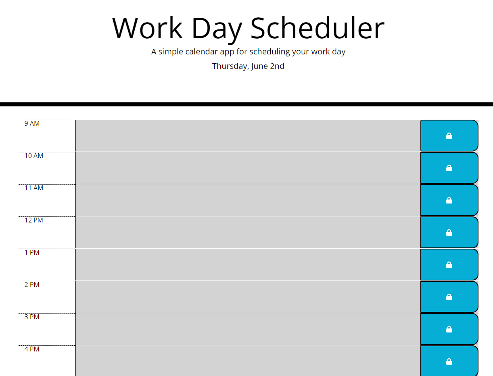

# Work Day scheduler

## Description

A work day scheduler that allows you to plan your work day by the hour.  Convenient color coding let you see tasks that should have been done( grey), currently due(red), or comming soon (green).

## Languages used

- HTML
- CSS
- javascript

## Libraries/frameworks/tools used

- jquery
- bootstrap
- moment.js
- fontAwesome

## Usage

[Deployed webpage](https://josephkurpierz.github.io/work-day-scheduler/)

[github Repo](https://github.com/josephkurpierz/work-day-scheduler)

To use this app, select the middle column to write/type in your chore/activity/task for the corresponding hour and click on the blue save button.  If that time has not passed yet and the color is red or green...you still have time to get it done and remain efficient.  Once it turns grey, you better be done with task or you might find yourself in a day of catchup(not the sauce).  

## License

[MIT license](./LICENSE.txt)